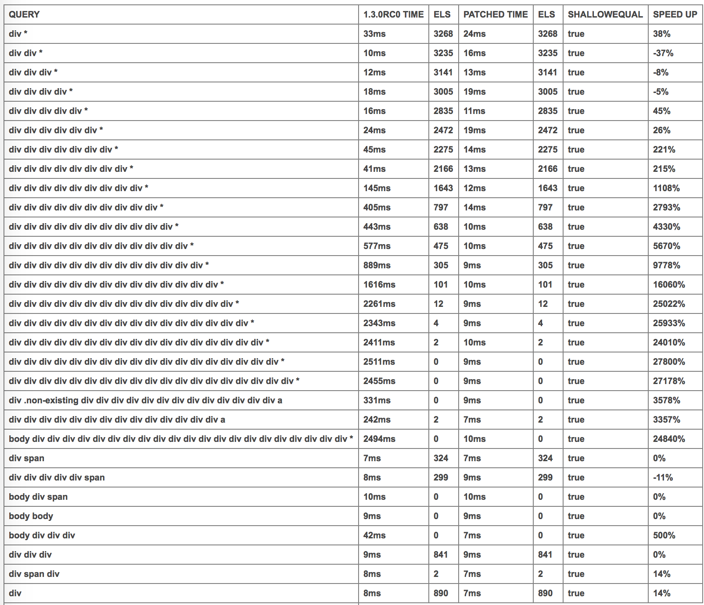

# Test code for CSS-Select pull request https://github.com/fb55/css-select/pull/94

* pull repo
* make sure 'css-select-patched' submodule gets pulled (`git submodule update --recursive --remote
`)
* run `npm run build` to build main.js
* open `test.html` file in browser.

# results:

